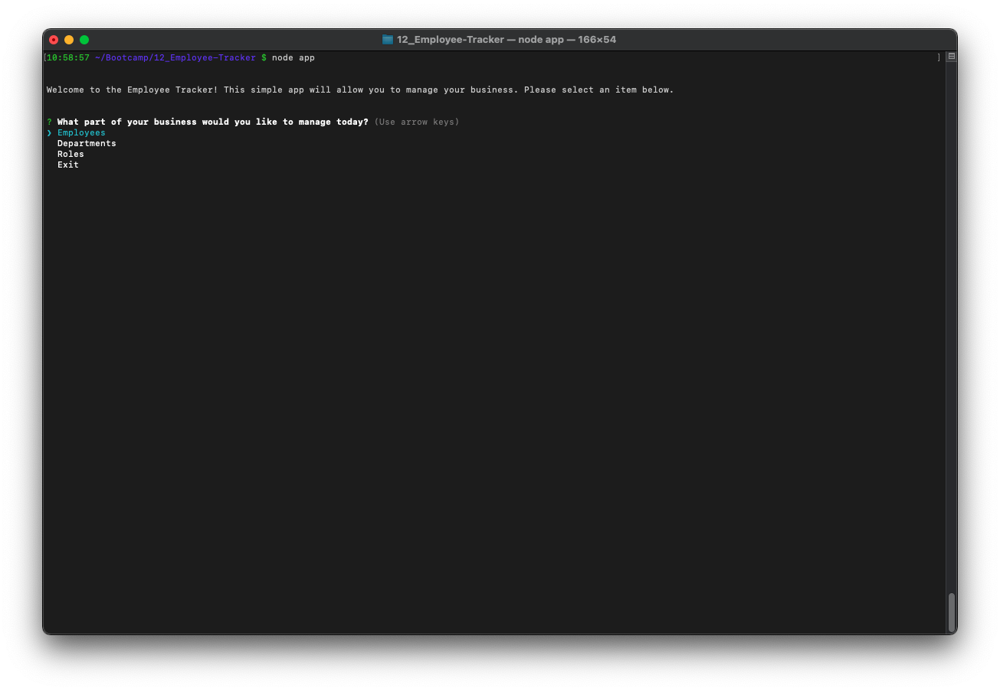
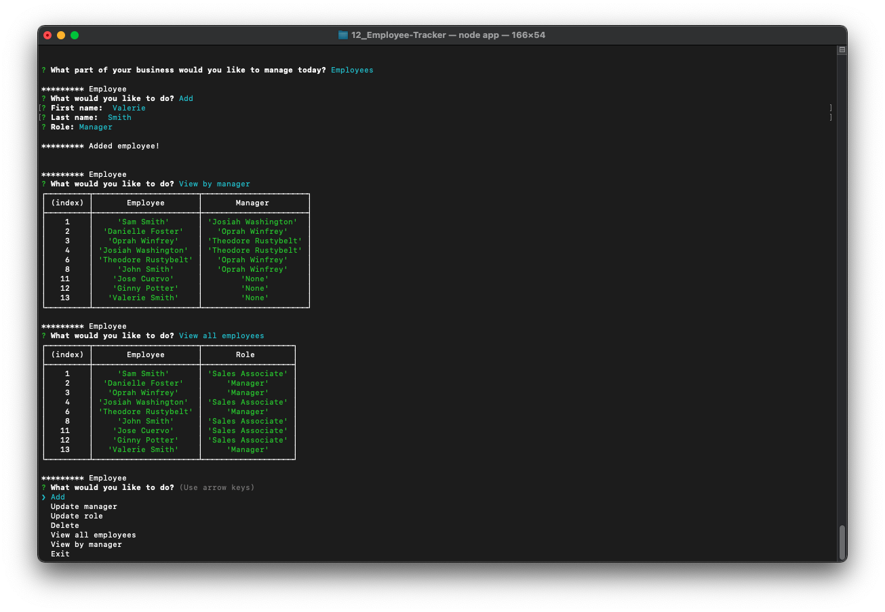
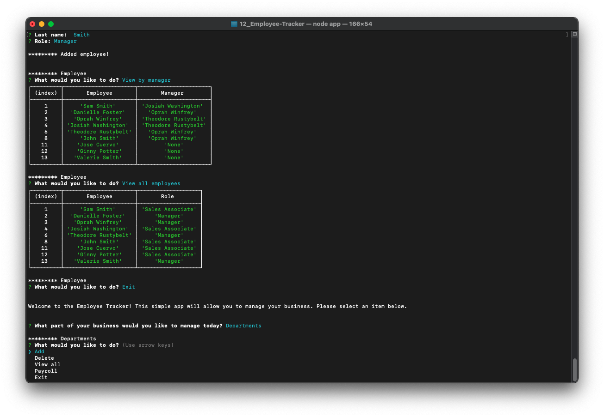

# Node Employee Tracker

## Description

This Node app allows users to manage a database of employees, managers, roles, and departments. This is a command line application that utilizes Inquirer. Features include adding, viewing, and deleting key data. Additional features include the ability to view the total payroll of a department, view employees by manager, or view employees by role, and more!

## Table of Contents

- [Installation](#installation)
- [Usage](#usage)
- [Contribute](#contribute)
- [Test](#test)
- [Video](#video)
- [License](#license)
- [Questions](#questions)

## Installation

Download the project files or clone this repo, then run npm install and it will install dependencies. I included a seed.sql file to create your new database and populate it with some test items I used during development.

## Usage

Type node app and follow the prompts! The app will ask you if you want to manage an Employee, Department, or Role. Each menu has sub-items that will gather input and assist you with managing your employees.

## Contribute

Email me with questions or comments. Any improvements are welcome!

## Test

Install the app, run the seed.sql script, and try it out! Make sure to have Node dependencies installed, as defined in the package.json file.

## Video

Please view a demonstration video [here](https://drive.google.com/file/d/1BB4kB-Clz8lQozW1mNumM0GpZOw5ujhc/view).

## License

Copyright (c) Sam Gates. All rights reserved.
Licensed under the [MIT](https://opensource.org/licenses/MIT) license.

## Questions

Check out my [GitHub Profile](https://github.com/sg0703).

Email with questions! You can reach me at sam.j.gates@gmail.com.
